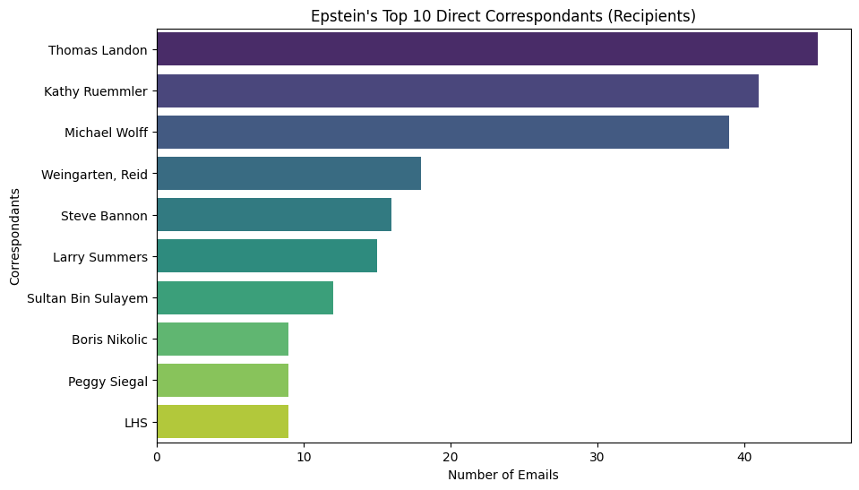
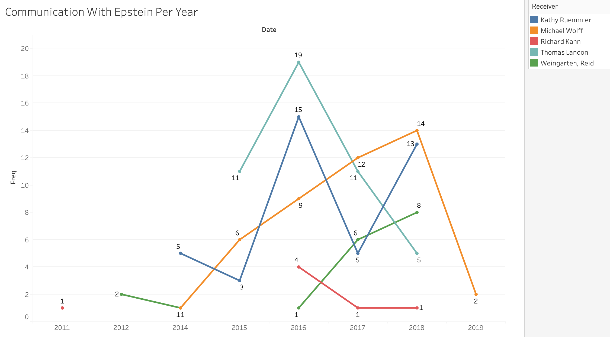

# Epstein: The Man, The Myth, The Legend (Rough Draft) 

*Note that the title is definitely changing, I just needed something*

# 1. Introduction

This analysis will focus on a rather sensitive and controversial topic, although I do not intend to dive into too much detail on anything.

My goal with this analysis is to answer the following questions:

- What connections can I make between people who appear in the Epstein files?

- For these connections, how long did they last? How often were they communicating with one another?

# 2. Background

For those unaware of the context for this situation, the following paragraphs will hopefully provide that.

Jeffrey Epstein was an American financier and sex offender. By the late 1980s, he had his own management firm which managed the assets of clients worth more than $1 billion. 

In the late 1990s, he purchased his infamous island. Without getting into much detail, this island was the center for an alleged long-term sex trafficing ring for minors.

Epstein was known to have a number of high-profile friends, some of which who will make an apperance in this analysis. Despite their appearance, I will refrain from coming to conclusions without proper evidence. However, I will include media speculations in hopes to prompt the use of critical thinking so that you may come to your own conclusions.

# 3. Basic Email Statistics

<sub>***Note for reviewers: The numbers in the following statistics are surprisingly low. I believe this is an issue with how I am parsing data. However, the results are similar to those found by others.***
</sub>

To start, I want to show various basic email statistics.

The first, is the top 10 people whom Epstein was emailing.



The second, is the top 10 people who were sending emails to Epstein.


In both cases, the top person was a man by the name of Michael Wolff.

Michael Wolff is an American journalist. In recent years, much of his work targets the current president, Donald Trump. Wolf was known to have a complicated relationship with Epstein, and one that largely stems from this targetting of Trump. According to various media sources, Wolff was in contact with Epstein to obtain information about Trump for his book titled [*Fire and Fury*](https://www.google.com/search?sca_esv=206cd4dd954885db&sxsrf=ANbL-n7pWDsL_ABw4jeHKG1RDOIXAnkrvQ:1772014052615&q=Fire+and+Fury:+Inside+the+Trump+White+House&stick=H4sIAAAAAAAAAONgFuLSz9U3MCk0NikvV-LVT9c3NEwzLsxNtyzI1ZLKTrbST8rPz9ZPLC3JyC-yArGLFfLzcioXsWq7ZRalKiTmpSi4lRZVWil45hVnpqQqlGSkKoQUleYWKIRnZJakKnjklxanAgBn5KJyZwAAAA&sa=X&sqi=2&ved=2ahUKEwixpZLhsvSSAxWxPDQIHeCcJHkQgOQBegQINBAG&biw=1512&bih=775&dpr=2). This is confirmed by the following email document:

```
From: Michael Wolff 
Sent: 2/15/2017 1:16:03 PM 
To: Jeffrey Epstein [jeevacation@gmail.com] 
Subject: A few favors... 
Importance: High 
So...I'm doing this Trump book for a pile of money and with so far quite a bit of cooperation from them (DT 
called me the other day and spent 45 minutes on the phone ranting and raving about the media--alarming). I 
wonder if you could introduce me to Tom Barrack--just to say I'm a journalist who you know and trust, and that 
I'll follow up with a description of the project that I'm doing. Also, I'd love a reintroduction to Kathy Ruemmler. 
I need some off-the-record perspective on White House procedures. 
Are you in NYC soon? 
HOUSE OVERSIGHT 032471 
```

# 4. Communication Frequency

Next, I want to look at the frequency of communication with Epstein that a few of these top individuals had. I want to find out when their communication with Epstein began, and for approximately how long it continued on for.

The following is a graph showing the number of emails sent by 3 individuals per year. These individuals are Kathy Ruemmler, Michael Wolff, and Richard Kahn, Thomas Landon, and Reid Weingarten.



I chose to focus on these 5 people as they had the most emails correspondences with Epstein.

Kathy Ruemmler, a top lawyer at Goldman Sachs, began her communication with Epstein in 2014. This communication lasted until 2019 following Epstein's death. Although she denied ever formally representing Epstein, many of these documents show that she advised him on media inquiries regarding his allegations.

Richard Kahn was Epstein's former accountant. As such its no surprise that he appears so frequently in the files.

Thomas Landon was a former journalist for *The New York Times*. Given the amount of emails exchanged between Landon and Epstein, it is safe to assume that these two had a close relationship. One such email exchange between the two shows Landon warning Epstein about another journalist, John Connolly.

```
Sent: 6/1/2016 3:47:12 PM 
To: Landon Thomas 
Subject: Re: The book on you... 
Importance: High 
every day 
On Jun 1, 2016, at 11:46 AM, Thomas Jr., Landon 
are you still getting calls from reporters re Trump? 
wrote: 
On Wed, Jun 1, 2016 at 11:28 AM, jeffrey E. <jeevacation@gmail.com> wrote: 
no 
On Wed, Jun 1, 2016 at 11:25 AM, Thomas Jr., Landon wrote: 
Keep getting calls from that guy doing a book on you -- John Connolly. He seems very interested in 
your relationship with the news media. I told him you were a hell of a guy:) One oddity: he said he 
had been told that that quote from Trump about you in the original NY Mag story had been 
manufactured. ie, that I did not actually speak to Donald. Which is bull shit of course. I am sure that 
is what Trump told him as they have been getting a lot of questions from reporters about you. 
He actually seemed to be a sensible guy/solid reporter -- just from the few conversations I had with 
him. I think he is close to finishing up. 
Did you ever speak to him? 
```

Lastly, Reid Weingarten was Epstein's personal lawyer. Again, this makes sense as to why so much communication appears between the two. Emails between Weingarten and Epstein often were about Trump or how to deal with the press.

# 5. Connecting People

<sub>*Note: This part isn't complete and will not be part of the draft. This ended up being more work than I anticipated. My goal for this is to create a graph with Epstein at the center and all connections (both direct and indirect where indirect connections are simply people that appear in the email bodies)*
</sub>

---