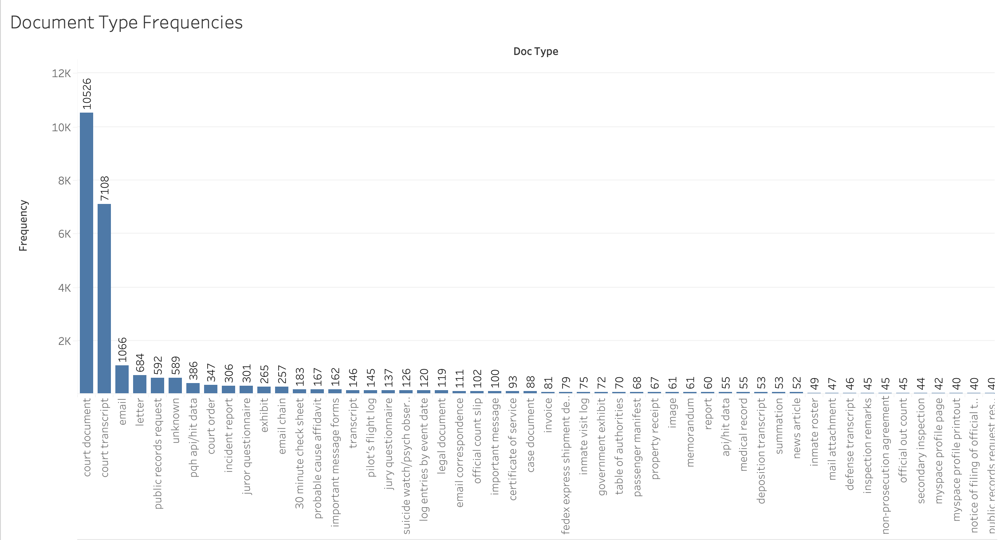
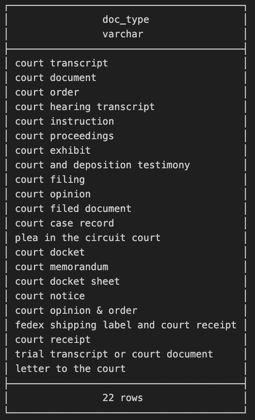
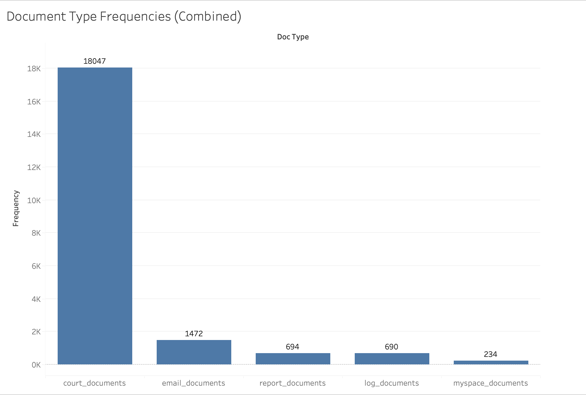
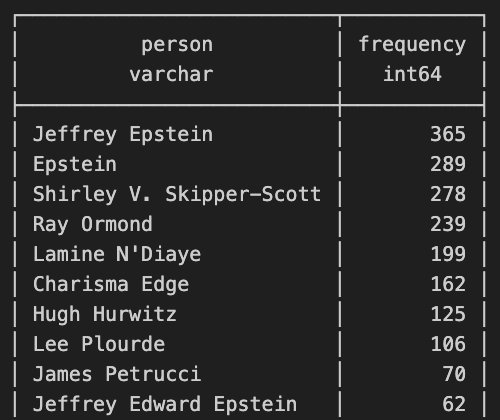

# Exploratory Data Analysis - Epstein Files

## Background

As per the proposal, I found a [GitHub repo](https://github.com/epstein-docs/epstein-docs.github.io/tree/main#) that was last updated 4 months ago. This repo took the Epstein files from that point in time and OCR'd them into JSON documents using OpenAI. For this reason, I believe there will be a numerous issues with the data mainly regarding naming inconsistencies or parsing errors. Additionally, there may be issues with how redacted information was parsed. For more information about the OCR process, please see the repo's README.

## First Looks

Each JSON document had a `document_type` in it's metadata field. The first thing I wanted to look at was the distribution of document types.

Unsurprisingly, there were a lot of `court_document` and `court_transcript` documents. This makes sense when considering that Epstein was involved in numerous civil and criminal cases.

## Data Cleaning

### Similar Document Types

Notice in the previous visual, that there are a multiple document types that are court related. A simple qurey shows that there are actually at least 22 occurences of document types contatining the word "court".

This is actually the case for many other document types. The primary ones that I will choose to focus on for this analysis are `court`, `email`, `report`, `myspace`, and `log`.

It is important to note that there are some document types that may have multiple of these keywords in them. I am choosing to ignore this and will consider these duplicate specific document types as being apart of multiple overarching keywords.

The following is the frequency distrubtion following this combination of document types.

Again, the majority of these documents are court related documents. For the sake of this analysis, this is not a problem as these will be analyzed separately.

### Similar Names

Now that similar document types have been combined into a single type, I wanted to look at the frequency of name occurences in the files. However, when I did this I noticed that there were different versions of the same name being used.

As we can see from this screenshow, there are 3 occurrences here alone for Epstein. The only differences are in the length of the name (First Name, Last Name vs Full Name vs only Last Name). To solve this, I can pattern match portions of people's names and combine their frequencies.

For example, with the above image I can add `WHERE name ILIKE '%epstein%'` to the query. While this will only solve the issue with Epstein's name, the idea is there for other occurrences.