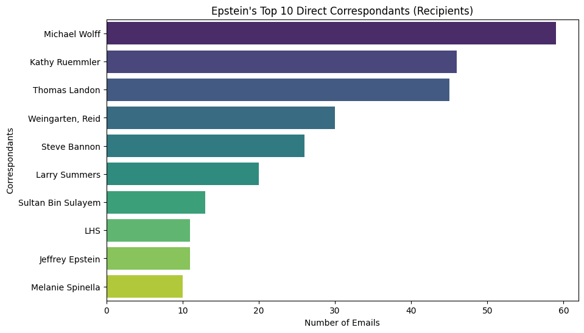
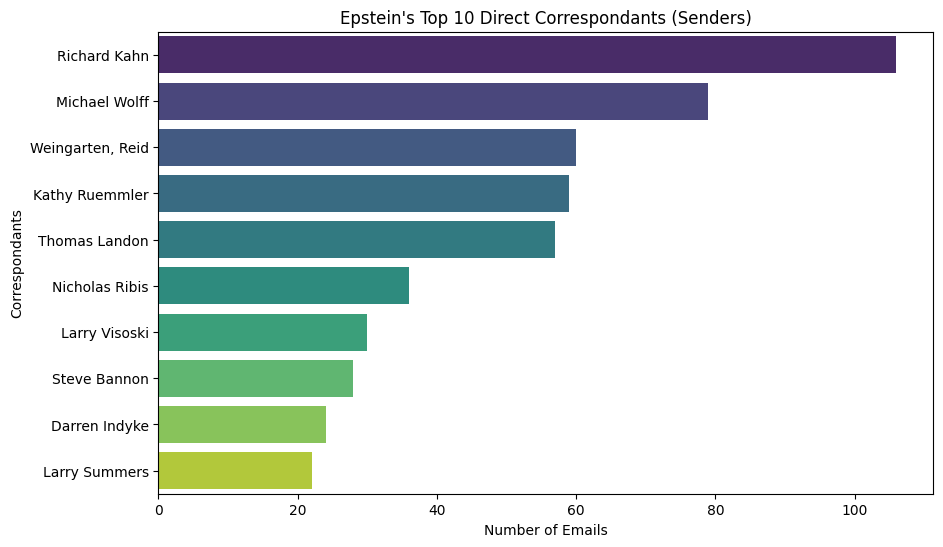
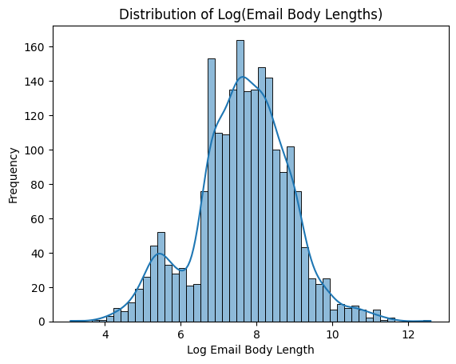
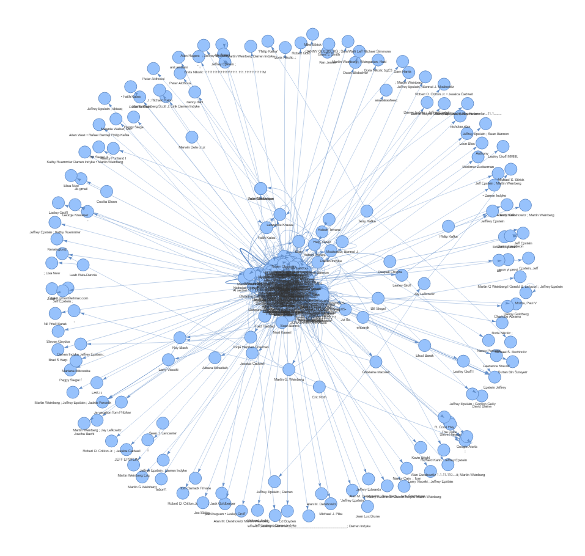
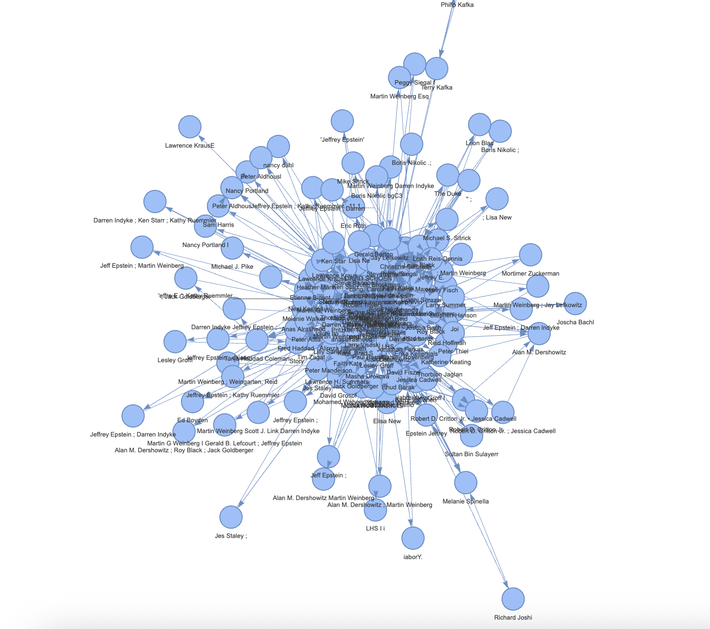

# Epstein Email Analysis

# 1. Introduction

This analysis will focus on a rather controversial topic, the Epstein files. Specifically, I will be focusing on the emails within these files.

My goal with this analysis is to answer the following questions:

- What connections can I make between people who appear in the Epstein files?

- For those connectionos, how long did they last? How often were they communicating with one another?

My data will be coming from a [dataset located on kaggle](https://www.kaggle.com/datasets/jazivxt/the-epstein-files/data).


# 2. Background

Jeffery Epstein was an American financier and sex offender. By the late 1980s, he has his own management firm which managed the assets of clients worth more than [$1 billion](https://en.wikipedia.org/wiki/Jeffrey_Epstein#:~:text=In%201988%2C%20while,%5B20%5D).

In the late 1990s, he purchased his infamous island in the United States Virgin Islands. This island was the center for an alleged long-term sex trafficing ring for minors.

Epstein was known to have a number of high-profile friends, some of which who will make an appearance in this analysis.


# 3. Data Cleaning

Disclaimer: These files are not up to date. The source was last updated several months ago, and do not feature any of the recent files.

--- 
As previously mentioned, this dataset was sourced from a user on Kaggle. The majority of this dataset are images, with some of these images being OCR'd into text documents.

These text documents were then scanned to identify emails. Emails were classified as any document in which the first 20 lines included the words `From:`, `To:`, and `Sent:`.

Once email documents have been found, it then became a matter of getting the data into a bettter format than text documents. To do this, many functions were used to parse the text file and then clean the data. The following are examples of data that needed to be cleaned. Note that these documents are the entirety of emails, including headers and bodies.

- Email Strings

```
jeeyacation@gmail.com,
jeevacation@gmail.com,
J Deevacation@gmail.com,
JEEvacation@gmail.com,
jeevacation@grnail.corn,
etc.
```

- Names Strings

```
Jeffrey Epstein [jeeyacation@gmail.com],
jeffrey E. [jeevacation@gmail.com],
Thomas Jr., Landon,
Michael Wolf,
Michael Wolff,
Richard Kahn,
Richard Kahn________________________________,
etc.
```

Note that a single email document may have contained a chain of emails, as such several different emails may have appeared in a single document. This analysis only looks at the first email within a document, even though it may belong to a chain of emails.

# 3. Basic Email Statistics

To start, I want to show various basic email statistics before exploring individuals.

The first statistic I want to look at are the top 10 peoplee whom Epstein was emailing. Specifically, these are people who Epstein was sending emails to.

<center>



</center>

The second statistic is the top 10 people who were sending emails to Epstein.

<center>



</center>

Lastly, I wanted to look at the distribution of email body lengths. As expected, this original distribution is very heavily right-skewed. As such, we will be looking at the log distribution of email body lengths.

<center>



</center>

With this distribution being approximately normal, this indicates that email body lengths follow a log-normal distribution. This means that email bodies are mostly on the shorter end, with few being very large.

There does appear to be a second peak, leading to the possible interpretation of this distribution as being bimodal. This likely corresponds to emails that are short response to others.

However, email body lengths from these text files are not entirely accurate. Many emails are filled with DOJ warnings, that vary in length and content. This leads to some email lengths being heavily padded in length.

## Michael Wolff

Michael Wolff was among the top people for both sending emails to and receiving emails from Jeffrey Epstein, but who is this man?

Michael Wolff is an American journalist. In recent years, must of his work targets the current president, Donald Trump. Wolff was known to have a complicated relationship with Epstein, and one that largely stems from this targeting of Trump. According to various media sources, Wolff was in contact with Epstein to obtain information about Trump for his book titled [*Fire and Fury*](https://www.google.com/search?sca_esv=206cd4dd954885db&sxsrf=ANbL-n7pWDsL_ABw4jeHKG1RDOIXAnkrvQ:1772014052615&q=Fire+and+Fury:+Inside+the+Trump+White+House&stick=H4sIAAAAAAAAAONgFuLSz9U3MCk0NikvV-LVT9c3NEwzLsxNtyzI1ZLKTrbST8rPz9ZPLC3JyC-yArGLFfLzcioXsWq7ZRalKiTmpSi4lRZVWil45hVnpqQqlGSkKoQUleYWKIRnZJakKnjklxanAgBn5KJyZwAAAA&sa=X&sqi=2&ved=2ahUKEwixpZLhsvSSAxWxPDQIHeCcJHkQgOQBegQINBAG&biw=1512&bih=775&dpr=2). This can be confirmed by the following email document:

```
From: Michael Wolff 
Sent: 2/15/2017 1:16:03 PM 
To: Jeffrey Epstein [jeevacation@gmail.com] 
Subject: A few favors... 
Importance: High 
So...I'm doing this Trump book for a pile of money and with so far quite a bit of cooperation from them (DT 
called me the other day and spent 45 minutes on the phone ranting and raving about the media--alarming). I 
wonder if you could introduce me to Tom Barrack--just to say I'm a journalist who you know and trust, and that 
I'll follow up with a description of the project that I'm doing. Also, I'd love a reintroduction to Kathy Ruemmler. 
I need some off-the-record perspective on White House procedures. 
Are you in NYC soon? 
HOUSE OVERSIGHT 032471 
```

## Richard Kahn

Richard Kahn was also among the top correspondants with Epstein. Kahn served as one of Epstein's accountants for over a decade who [managed his finances, investments, and other details](https://www.cbsnews.com/news/richard-kahn-jeffrey-epstein-house-oversight-testimony/#:~:text=Richard%20Kahn%20was%20one%20of%20Epstein%27s%20closest%20associates%20in%20his%20final%20years%2C%20managing%20his%20finances%2C%20investments%20and%20other%20minutiae%2C%20such%20as%20renovations%20on%20Epstein%27s%20private%20Caribbean%20island.).

Kahn has been accused by some of Epstein's victims as playing an instrumental role in creating the infrastructure that enabled Epstein's crimes. Kahn is set to testify to House committee on 3/11/2026.

While I was unable to find any emails to prove this, there are emails that discuss Epstein's relationship with various people.

### Donald Trump
```
From: Richard Kahn 
Sent: 6/22/2018 1:12:21 PM
To: Jeffrey Epstein [jeeyacation@gmail.com]
Importance: High
see video at the bottom of the page as someone at rally printed a picture of you and trump together
https://www.washingtonexaminer.com/news/watch-trump-kicks-out-protesters-from-rally
Richard Kahn
HBRK Associates Inc.
575 Lexington Avenue, 4th Floor
New York, NY 10022
HOUSE OVERSIGHT 033313
```

### Bill Clinton

```
From: jeffrey epstein [jeeyacation@gmail.com] 
Sent: 5/16/2011 8:28:27 PM
To: Richard Kahn
Subject: Re: Check ou1- Sok p5 Google
Forwarded message
From:
Date: Sat, May 14, 2011 at 6:43 PM
Subject: Re: Check out
To: jeevacation@gmail.com
- Sok pa Google
wrote:
JEFFREY EPSTEIN - YOU ARE THE BEST - YOU MADE NOT ONLY MY DAY BUT MY TRIP! TACKHBE
In a message dated 2011-05-14 12:18:45 Eastern Daylight Time, jeevacationaqmail.com writes:
she has been in my house. I will give you the 25k that you need.
On Sat, May 14, 2011 at 5:20 PM, wrote:
Click here:________________________- Sok pa Goodie I met this terrific girl in a church in Gotland, godmother to my friend
Angelina Johns baby girl..she was so beautiful I thought - and she is obviously! And nice! Wants to do
more good for Africa than she already does..thought of you but she may not be the Swedish girl we look for....
I am packing last minute - did not hear back from you...its ok I understand if it was much to ask for...but you did it last
year so now when things are tough you spoilt me..! I will meet your friend Bill Clinton in Stockholm this Thursday - at the
royal opera!! - next year SALSS - if I survive this year...will have a focus on Globalization and I thought I ask him to
come....?! Anyway, off we go, me and Lalla...to start with to interview 10 candidates for FEOY 2011...Much love BE
HOUSE OVERSIGHT 031036
```

## Thomas Landon

Thomas Landon is a former journalist for The New York Times. He has been linked to controversies regarding his coverage of Epstein. His email conversations with Epsteins shines a light on the relationship between reporters and their sources. 

In one such email, Landon warns Epstein about John Connolly, an author in the process of writing the book [*Filthy Rich: A Powerful Billionare, the Sex Scandal that Undid Him, and All the Justice that Money Can Buy: The Shocking True Story of Jeffrey Epstein*](https://www.google.com/search?q=Filthy+Rich%3A+The+Shocking+True+Story+of+Jeffrey+Epstein&rlz=1C1ONGR_enUS1102US1102&sourceid=chrome&ie=UTF-8)

```
From: Thomas Jr., Landon 
Sent: 9/27/2017 2:47:47 PM
To: Jeffrey Epstein [jeeyacation@gmail.com]
Subject: Got another call from Connelly..
Importance: High
He is digging around again -- not clear if its another book/or expanded paperback version. Was
asking me all sorts of questions about why you hired Ken Starr. I told him I had no idea -- I think he is
doing some Trump-related digging too.
Anyway, for what its worth...
Landon Thomas, Jr.
Financial Reporter
New York Times
http://topics.nytimes.com/top/reference/timestopics/people/t/landon jr thomas/index.h
tml
HOUSE OVERSIGHT 032633
```

# 4. Creating Network of People

One of my biggest goals for this analysis was to create a graph network that shows the connection between people in the Epstein files. While there is plenty of room for improvement in my results, there is still useful information from what I have.

The following graphs were created by first connecting the sender and receivers of each email and assigning them an edge weight of 1. Every subsequent appearance of the same $(Sender, Receiver)$ pair, increased the edge weight by 1.

Then, the body of each email was parsed for named entities. While I wish I could have used only named entites that were tagged as people, entities such as "Trump" were tagged as an organization. As such, all named entities are also added to the graph, connecting itself to the sender and receiver of it's respective email. To account for the aforementioned issue, they are given $\frac{1}{10}^{th}$ of the weight.

Below are the resulting graphs.

### [Entire Email Network](./email_network_entire.html)

This first image shows the network in its entirety. Node distances correspond to infrequency. This means that the further away a node is, the less frequent of communication they had with others. As we can see, there are a lot of nodes around the edge of the network. These nodes mainly correspond to the following sets:

- People who appear infrequently in files.

- People who have many variations in how the names were OCR'd.

- Emails that had many recipients and, as such, were not fully parsed.
    - This was because there were **many** different ways that multiple email recipients were listed.

<center>



</center>

### [Largest Strongly Connected Component of Email Network](./final_draft/email_network_scc.html)

Now, only looking at the largest strongly connected component of the email network, we see that we hone in on the central area.

<center>



</center>

