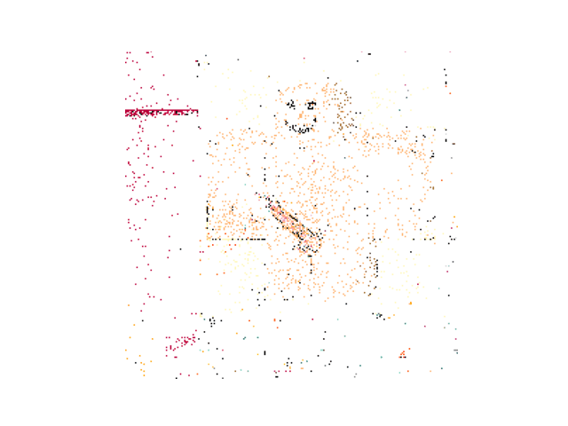
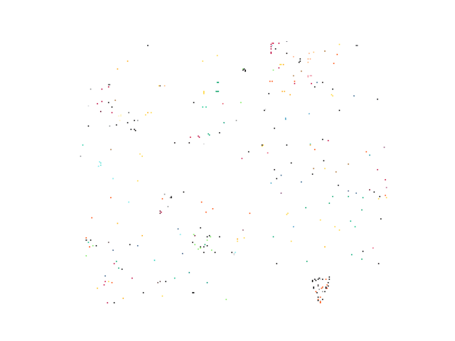
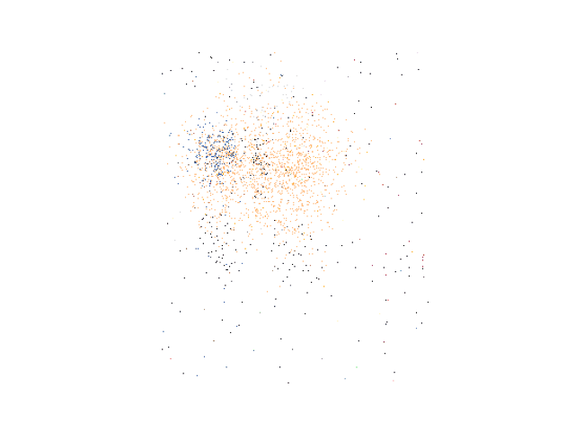

# Week 4 Analysis - Irregular Activity on r/place

### Context

For this week's analysis assignment, we are tasked with identifying the major buckets of irregular activity on r/place. `Irregular activity` is being defined as any pixels that were not placed by regular human users. The following is what I found.

## Admins

There are 19 distinct admin placements. These were classified as pixels that were placed but their coordinate field contained 4 numbers instead of the usual 2.

The assumptino here is that these 4 numbers correspond to the vertices of a rectangle. As we will see, these rectangles were drawn to censor innapropriate art.

Below are a few examples of such censorship taking place.

### NSFW warning

    
Click to reveal NSFW gifs

    
    
    

    More GIFs can be found in the admin_gifs/ directory.

As we can see, when innapropriate art begins to appear, the admins would draw several rectangles to censor the art while still trying to preserve other people's artwork that is not in violation. For exmaple, several of these gifs show that these admins used similar color to the art in which the violation initially covered.

## Cheaters

These are users who took advantage of r/place canvas updates happening asynchronously, and placed pixels rapidly without invoking their cooldown timer. 

Note, that some users would accidentally experience this, but **cheaters** are those who appear to be intentionally taking advantage of this. Intentional behavior is classified as this event occurring for a majority of a user's pixel placements. 

`user_id 4052128`

As we can see from this gif, there are multiple instances where the user is placing multiple pixels in a single instance. 

## Bots

Bots can be identifited through several patterns.

1. Single Account Bots
    - These are single accounts which place pixels at approximately the same location at approximately even time intervals.

2. Multi Account Bots
    - These are bots that span many accounts which place pixels that span the same location at approximately even time intervals. These are often easier for admins to detect given a raw username, as these often indicated mass account creation.

An example of a single account bot is the following:

In this case, the user is constantly placing a pixel in the same location at even time intervals which corresponds to their cooldown timer.

Another example of potential bots can be seen in the following gif. This animation shows all user placements over the entire time period who had a suspiciously low standard deviation of `time_since_last_placed`.

We see that there are a lot of small blobs of pixels that appear. These blobs are continously placed on during the entire duration of event on even intervals, indicating bot behavior.