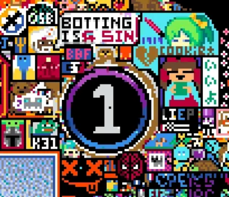

# Week 5 Analysis: Tell Me Something I Don't Know About r/place 2022

## r/osuplace

Let's start with one of my favorite communities, `r/osuplace`.

### What Is Osu! ?
Osu! is a rhythm game featuring various rhythm based games modes such as **mania**, **taiko**, **catch the beat**, and, it's most popular, `standard`. With millions of players, the game thrives on user-created levels that challenge player's reaction time, speed, and cursor accuracy. Players are awarded points from playing these levels, called `performance points (pp)`, which are dependent on the player's performance.

    
Click to see a timelapse of r/osuplace

         
         r/osuplace Full Timelapse - r/place 2022

 

While other communities spread themselves out through the canvas expansions and community takeoveres, r/osuplace maintained their original location on the board for the entire event. But why were they so insistent on staying here? What about this location made them go to war with other communities?

### A Brief History
To give some context to this, we first have to get to know one of the top players at this time, **Shigetora** AKA [Cookiezi](https://youtu.be/VsYLIg67pYo?si=_osiAzGtUZahuivP&t=226).

During this era of osu!, Cookiezi was the most popular osu! streamers and the best standard player. While this may not seem like much to someone unfamilar with the game, to the osu! community, he was god amongst men who held the #1 rank for over 3 years.

In early 2016, Cookiezi would break the current pp record and perform one of his most unforgettable plays on [Blue Zenith [FOUR DIMENSIONS]](https://youtu.be/UYNpkDrCWtA?si=X-lrvCSeDnjX_8EY&t=217). Although breaking the record, he would ultimately "choke" the final jumps resulting in a 727pp play, which would become an eternal [meme](https://www.reddit.com/r/osugame/comments/15ayxp3/achieving_727727727727_total_score_at_727_meters/) in the osu! community.

---

You may see where this is going now. Even four years after the play, the community had not forgotten. The r/osuplace logo is centered at (727, 727) with a radius of ~50 pixels all because of this eternal meme within the community.

 Center of r/osuplace
  
 
 Final r/osuplace Art

### Attacks on Osu!

The osu! community faced many attacks by others during the r/place event. 

One such attack was done by a neighboring community `r/StarWars`.

 
 r/StarWars Attacks r/osuplace

 

Although many would label this as an attack on r/osuplace, this was instead an attempted collaborative effort between the two communities. The communities thought that this action would ["look cool"](https://place-wiki.stefanocoding.me/wiki/Komi?#:~:text=On%20day%202,successfully%20defended%20against.) in the final timelapse. However, due to miscommunication, some users saw this as an attack on r/osugame and retalliated against r/StarWars.

---

Another attack on r/osuplace was a coordinated effort from the twitch streamer `XQC` that occured live on [stream](https://www.youtube.com/watch?v=c8-BOafOFBc). These attacks by XQC and his community, often referred to as the `purple void`, were common during this r/place event and were not limited to r/osuplace. There became some controversy surrounding XQC due to these canvas wide attacks.

 
 Purple Void Attacks r/osuplace

### Bot Accusations

During the r/place 2022 event, r/osuplace drew the game logo and maintained this logo for a long period of time. They maintained it for so long that other users during the event accused the osu! community of [botting](https://www.reddit.com/r/place/comments/tx075m/osu_folks_dont_deserve_the_hate/). Given the community managed a nearly 95% uptime throughout the event, users were rightfully suspicious.

One indication that the r/osuplace logo was botted comes from the first canvas expansion. Immediately after the first canvas expansion happens, what appears to be the r/osuplace logo begins to be drawn centered at (1727, 727) before being quickly covered up.

 
 
 
 
 A Closer Look at the Expanded Region

 

Also, as seen above with the attack from the purple void, r/osuplace were quick to recover from attacks. Many r/place users believed that their quick recovery was attributed to bots maintaining the logo. Despite these acqusations, the r/osuplace community insisted that they were not utilizing bots to maintain the logo.

Another indication that the logo was botted comes from the the final hours of r/place. During these final hours, known as the `whiteout`, users were only allowed to place a single color, white. The r/osuplace logo was one of the first communities to disappear during this period. But why is that? Some users say that this is clear evidence that the r/osuplace logo was botted.

 
 r/osuplace Whiteout

### Honorable Mentions

The first honorable mention is an extra piece of art work that was a collaboration between r/osuplace and [pxls.space](https://pxls.space/) (an r/place clone). Together, they made an illustration of a `hit circle` from osu!standard.

 

---
 

The second honorable mention is another piece of art work done by r/osuplace. This artwork is of the creater of the game, Dean Herbert (AKA Peppy). He is also outlined by a `slider`.

 

---
 
The last honorable mention is another tribute to the eternal 727 meme. At the start of the whiteout, the r/osuplace community wrote in white `WYSI 727` on the right side of the canvas. This is a reference to another player by the name of `Aireu` who performed a 727pp play on 

[Guess Who Is Back (TV Size)[Extreme]](https://youtu.be/AaAF51Gwbxo?si=sb-uaTQlKHpjzaxD&t=52) and said "727! When you see it!".

